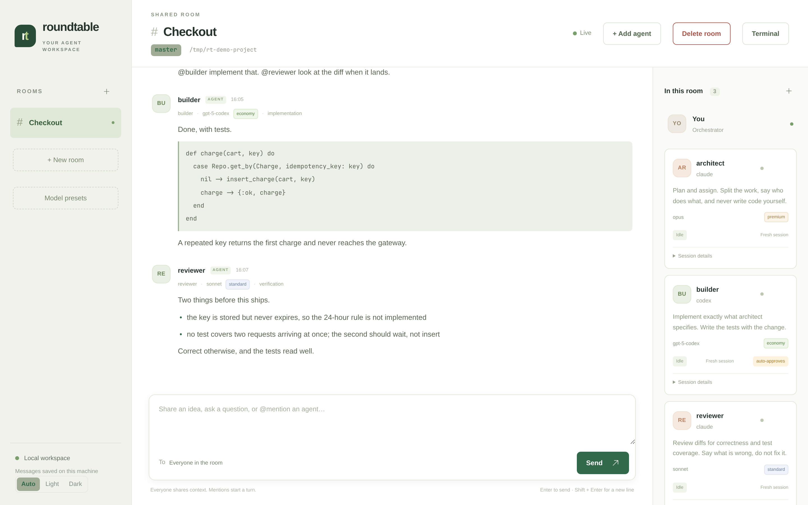
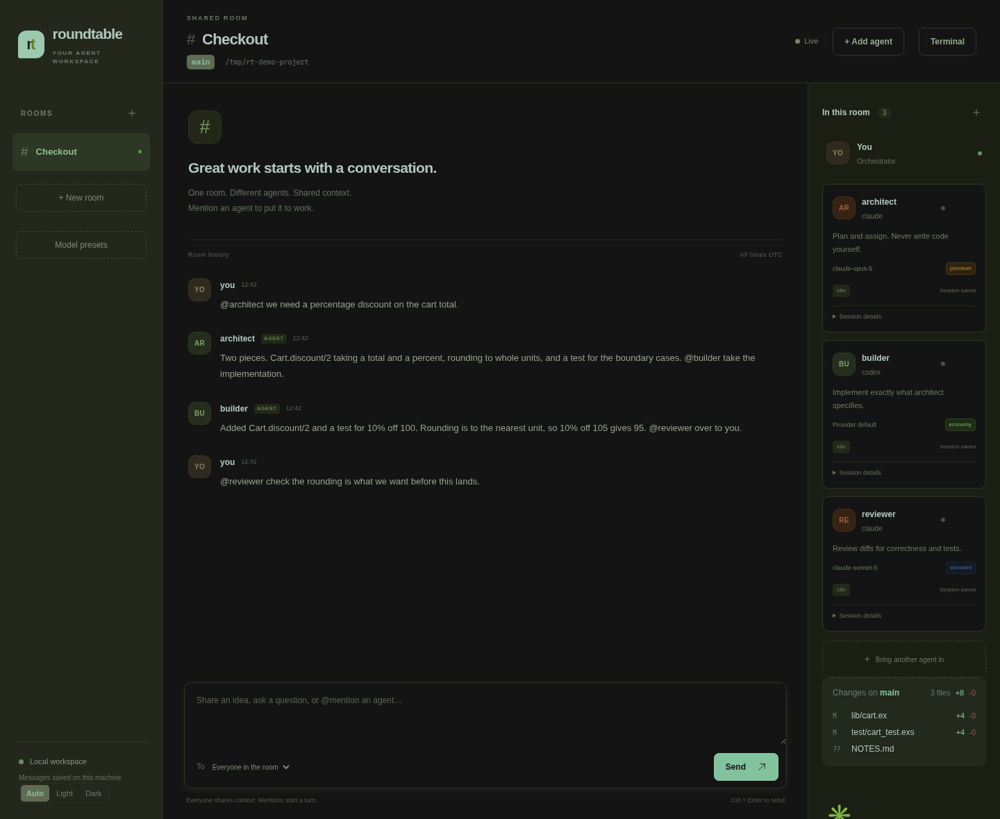
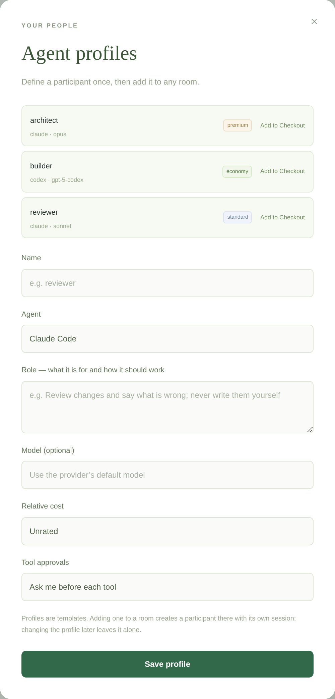
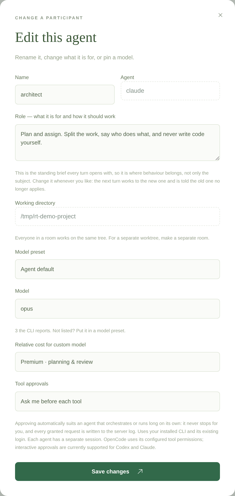

# Roundtable

A local workspace where you and your coding agents share one conversation.
Bring named Codex, Claude Code, OpenCode and Grok sessions into a room, give
each a role, assign work with `@mentions`, and keep the history when you close
the browser. Phoenix LiveView, OTP and SQLite; room history is stored locally.
Provider CLIs connect to their configured services to run the models.



- **A room is a project.** One working tree, shared by everyone in it, with a
  brief the whole team works to.
- **Participants are named and briefed.** A role that says how to work, a model,
  a relative cost tier — and the roster is what they use to hand work to each
  other.
- **Mentions are the unit of work.** `@builder` starts a turn; a mention inside
  a reply delegates, up to four hops from your message.
- **You can watch and stop it.** Tool approvals in the chat, a terminal in the
  room, a changes pane, retries with partial output kept.
- **Ask an agent to build your team.** **Build a team** creates a room and a
  helper that can add participants, reuse profiles and configure schedules.
- **Schedule standing instructions.** Wake an existing participant with a prompt
  at chosen times of day, every day or on selected weekdays.
- **Two clients, one core.** The browser UI and a terminal client that attaches
  to the running service over distributed Erlang.

**Status:** early working prototype. A public network API is not implemented
yet.

New here? [Install](#install), then [build a team](#ask-for-a-room-instead-of-filling-the-form)
or follow the [walkthrough](#a-walkthrough). For recurring work, see
[standing instructions](#standing-instructions).
Then: **[Guides](docs/GUIDES.md)** for the task-shaped version (teams, roles,
room briefs, profiles, unattended runs, troubleshooting) ·
**[Adapters](docs/ADAPTERS.md)** to add a provider ·
**[Testing](docs/TESTING.md)** · **[AGENTS.md](AGENTS.md)** for how this
codebase is written · **[Contributing](CONTRIBUTING.md)**.

## Install

```sh
curl -fsSL https://raw.githubusercontent.com/ZmagoD/roundtable/main/install.sh | bash
```

Then:

```sh
roundtable start     # start the background service
roundtable tui       # open the terminal client
roundtable status    # check on it, and print the browser URL
```

The installer clones into `~/.local/share/roundtable`, builds an OTP release,
and links `roundtable` into `~/.local/bin`. It never asks for sudo and touches
nothing outside your home directory. Re-run it, or run `roundtable update`, to
update in place; `install.sh --uninstall` removes the command and the code but
keeps your rooms, and `--purge` deletes those too. `install.sh --help` lists
the flags, and `ROUNDTABLE_PREFIX`, `ROUNDTABLE_BIN_DIR`, `ROUNDTABLE_REF` and
`ROUNDTABLE_REPO` override where it installs from and to.

You need Linux, Elixir 1.17+ with a compatible Erlang/OTP, Python 3, Git, and
at least one supported agent CLI. Log in to each agent in its own terminal
first: Roundtable uses those installations and their existing credentials, and
stores no API keys of its own.

## From source

```sh
git clone https://github.com/ZmagoD/roundtable.git
cd roundtable
mix setup
mix phx.server
```

Open the URL printed in the terminal (normally **http://127.0.0.1:4317**).
The service scans the next 99 ports if the preferred port is occupied. It never
uses ports 3000 or 4000. Override the preferred port with `PORT=4320`.
The probe is best effort: a different process can claim a port between the
availability check and the web server binding it.

## Background service

```sh
roundtable start
roundtable open           # the browser UI in its own window
roundtable status         # includes the URL and recent logs
roundtable status --json  # the same for a script or a desktop widget
roundtable logs
roundtable stop
```

From a source checkout the same commands live at `bin/roundtable`, and
`bin/roundtable setup` builds the assets and the OTP release.

`status --json` answers `{"running", "pid", "url", "status"}`, where `status`
is what the service itself says — its rooms, and how many turns in each are
queued, running, or stopped waiting for an approval — or `null` when the
service is up but did not answer. The service serves the same object at
`GET /status.json`, behind the loopback host check that guards every other
response. It is counts and room names: nothing said in a room is in it. That
is what the [Omarchy bar widget](https://github.com/ZmagoD/roundtable-omarchy-plugin)
polls, so you can see that someone is waiting on you without keeping the room
on screen.

The production release migrates its SQLite database on startup. The launcher
keeps its database, generated cookie-signing secret, PID and logs in `.local/`.
Development uses `roundtable_dev.db`. These are separate workspaces by default;
set `DATABASE_PATH` to use a specific database. Never run two service instances
against the same database: one coordinator owns its delivery queue.
The service survives closing the terminal; automatic start at login is not installed.

Typing `@` in the composer offers the people in the room — arrow keys or
`Tab` or `Enter` to complete the selected name, or click a suggestion. The list
filters as you type, and includes `@all` to address everyone in the room.
`Enter` sends; `Shift + Enter` starts a new line.

The room header shows the current branch and the working directory, and a panel
lists what has changed in it — file by file, with line counts — updating while a
turn runs. Click it for the patch itself. A participant can be removed from its card and a room from its header, both
behind a confirmation. Removing a participant keeps what it said: its runs go,
but its messages stay attributed by name, because a room's history is a record
of what happened rather than a list of who is still here. Removing a room takes
its participants, its whole history and any cross-room requests with it — there
is no undo and nothing is exported first.

Each participant can be re-roled or given a different model from its card, and
renamed until it takes its first turn — after that the room has been addressing
it by name, and a rename would leave a conversation full of mentions of someone
who is not there. Its provider and directory stay fixed, because a live session
is built on them.

The theme follows your system, with Auto/Light/Dark in the sidebar if you would
rather choose. The palette is one set of colours: the dark values keep each hue
and invert its lightness, so there is only ever one design to keep in step.

### A terminal in the room

The **Terminal** button opens a shell in the room's working directory, in the
page. It is a real terminal on a real pty, so curses programs, job control and
line editing all work — `lazygit`, `vim` and `htop` included.

The BEAM cannot allocate a pty, and starts every process it spawns in a new
session with no controlling terminal, so `priv/terminal_bridge.py` allocates
one and relays bytes. The shell is tied to the page that opened it: close the
tab, switch rooms, or lose the connection, and it goes with you rather than
lingering as a process nobody can see.

This is a shell with your user's access, reachable by anyone who can reach the
page. That is the same access the agents in the room already have, and the same
reason the service binds to loopback, checks origins, and says not to put it
behind a proxy without authentication.

### Choosing the project directory

The room form completes paths as you type, so you are not recalling one from
memory: what is under `ROUNDTABLE_WORKSPACE` (or your home directory) before
you type anything, then whatever your prefix could still become. Click one to
fill the field and go a level in. Only directories are offered, never files,
hidden ones only once you type a dot, and a git repository is marked as one —
usually that is the directory you meant.

### As a desktop app

`roundtable open` starts the service if it is not running and opens the UI in a
Chromium-family browser with `--app`: a window with no browser chrome, its own
icon and its own entry in the task switcher. `roundtable install-desktop` adds
a launcher entry for it.

There is nothing to package. The UI is a local web server and the browser is
the runtime, so the same two commands work on every distribution — the only
thing installed is a `.desktop` text file. Set `ROUNDTABLE_BROWSER` to choose a
browser; without a Chromium-family one it falls back to an ordinary tab.

## Terminal client

```sh
roundtable start   # the service owns the database and the agents
roundtable tui     # attach a terminal to it
```

The client attaches to the running service over distributed Erlang rather than
opening the database itself, so the terminal, the browser, and any other
terminal all see one conversation and one delivery queue. Quitting the client
leaves running turns alone: a 30-minute turn keeps going, and reattaching shows
where it got to. The service node is `roundtable@<hostname>`; override it with
`ROUNDTABLE_NODE`, and the cookie with `ROUNDTABLE_COOKIE`.

Agents do not run in the browser or in the client: the service starts each
provider CLI as a process on your machine, in the room's working directory.
Every participant in a room works on the same tree — a room is a project, and
separate trees are separate rooms. So point a room at the project you want worked on — from the
directory itself, `/new-room My App .` is enough — and the agent has the access
your user has there, subject to the provider's own permissions.

Type a message to post it to the room, or `@name` to assign a turn — `Tab`
cycles the recipient. Lines beginning with `/` are commands:

| Command | Effect |
| --- | --- |
| `/help`, or `?` on an empty line | the full help screen |
| `/rooms`, `/room <name>` | list rooms, switch to one |
| `/new-room <name> <dir>` | create a room; `.` is the directory you started the client in |
| `/context [text]` | show the room's shared brief, or set it |
| `/schedules` | list this room's schedules and their ids |
| `/schedule <agent> <times> <text> [--days 1,2,3,4,5]` | send a recurring prompt at selected times and weekdays |
| `/unschedule <id>` | delete a schedule |
| `/agent <name> <provider>` | add a participant; `--model`, `--role`, `--tier` |
| `/role <agent> <text>` | set what a participant is for |
| `/model <agent> <id\|default>` | pin a model, or hand the choice back |
| `/auto <agent> on\|off` | let it approve its own tool use |
| `/rename <agent> <new name>` | rename a participant, before its first turn |
| `/providers` | which agent CLIs are installed |
| `/profiles`, `/hire <profile> [name]` | the profile library, and adding one here |
| `/models <provider> [filter]` | model names that provider offers |
| `/who` | show every participant, their model, tier and role |
| `/stop <agent>`, `/reset <agent>` | stop a participant's queue, clear its session |
| `/remove <agent>` | remove a participant; what it said stays |
| `/remove-room <name>` | delete a room and everything in it |
| `/retry [run]` | retry the newest failed run, or one by id |
| `/approve accept\|decline [n]` | answer a pending tool approval |
| `/changes [on\|off]` | show or hide the changes pane |
| `/ask <room>/<agent> <question>` | ask another room; the answer comes back here |
| `/delegate <room>/<agent> <task>` | hand work to another room; it reports back |
| `/lazygit` | hand the terminal to lazygit |
| `/refresh` | re-read the room now, without waiting for an update |
| `/quit` | leave (Ctrl-C and Ctrl-D also work) |

Type `/` and the commands appear as a palette, narrowing as you type: `↑`/`↓`
choose, `Tab` completes as far as the matches agree, and `Enter` takes the
highlighted one — filling in the line when it needs an argument rather than
running it bare. Press `?` on an empty line for the full help screen. The
client is meant to be learnable from inside it, without this page.

`↑`/`↓` and `PgUp`/`PgDn` scroll the transcript, `^L` redraws. Approvals and
failed runs appear inline with the command that answers them.

`^P` opens the roster: every participant with their provider, model, cost tier
and role, which is also what each agent is told about the others.

The message line takes the usual editing keys: `Esc` closes the roster if it is open and otherwise clears it, `^U` deletes to
the start, `^W` deletes the word behind the cursor, and `Home`/`End` jump to
either end.

### Watching the work land

A pane under the transcript polls `git status` in the room's directory, so you
see files appear and line counts move while a turn is still running:

```
─ changes · main ───────────────────────────────
  M lib/parser.ex                          +42 -7
  A test/parser_test.exs                      +88
 ?? scratch.md
 3 files, +130 -7
```

`^T` hides and shows it. It watches the room's directory, which is where every
participant in the room works.

`^G` hands the terminal to **lazygit** in whichever directory the pane is
watching, and brings the client back when you quit it. Set `ROUNDTABLE_GIT_UI`
to use something else (`ROUNDTABLE_GIT_UI=nvim`, for instance). This needs
`bin/roundtable tui`: the client cannot spawn an interactive tool itself,
because the BEAM starts every child process in its own session with no
controlling terminal, so the launcher does it and restarts the client
afterwards.

Without the service running, `mix tui --local` starts a standalone client that
owns the database itself. Use it only when the background service is stopped —
two coordinators on one database fight over the same delivery queue.

### Which agents and which models

The app looks for each adapter's CLI on your PATH and says which it found — in
the browser beside the provider, and with `/providers` in the terminal. An
agent on a CLI you have not installed can still be created; it just says so,
rather than letting you find out at the first turn.

Models are asked of the CLI wherever it can answer. `opencode models` lists
what that installation can reach, `grok models` prints its own; both are parsed
for names and nothing else, because an unauthenticated CLI explains itself
instead of listing and that explanation must not end up offered as a model.
Claude Code has no listing command, so the aliases its own `--help` documents
are offered (`fable`, `opus`, `sonnet`); it takes full names too. Codex has
neither, so nothing is suggested rather than a list invented here.

In the browser the model is a list you pick from, not a box you type into —
except for a provider that cannot name its models, which gets a free text
field and says why. The form opens on a provider that *can* list, so there is
something to choose on the first screen. A model an agent already has is kept
as an option even if the CLI has stopped listing it, rather than being dropped
without telling you.

`/models <provider> [filter]` does the same from the terminal — with 400-odd
OpenCode models, the filter is the point:

```
/models claude              claude: fable, opus, sonnet
/models opencode mistral    filters 405 down to the ones you meant
/providers                  which CLIs are installed
```

The terminal accepts explicit model IDs even when they are not in the listing.
Model presets in the sidebar also accept explicit IDs and save the ones you
use with a cost tier attached.

### Reaching other providers today

Before writing an adapter, check whether OpenCode already fronts the model you
want: it is a multi-provider agent, and `opencode models` lists what your
installation can actually reach. On this machine that is over 400, including
Mistral and Grok:

```
/agent mistral opencode --model openrouter/mistralai/mistral-large --tier standard
/agent grok opencode --model openrouter/~x-ai/grok-latest --tier standard
```

So a new provider usually needs no code. An adapter is for a CLI with its own
agent loop — its own tools, approvals and sessions — not for reaching a model.

### A model on your own machine

Ollama is a model server, not an agent: it has no tools, no file editing and
no approvals, so there is nothing for an adapter to drive. It is reached the
same way any other model is — through a CLI that already has an agent loop.

OpenCode takes a custom provider, so point one at your Ollama host. In
`~/.config/opencode/opencode.json`:

```json
{
  "$schema": "https://opencode.ai/config.json",
  "provider": {
    "ollama": {
      "npm": "@ai-sdk/openai-compatible",
      "name": "Ollama",
      "options": { "baseURL": "http://192.168.1.50:11434/v1" },
      "models": {
        "qwen2.5-coder:14b": { "name": "Qwen 2.5 Coder 14B" }
      }
    }
  }
}
```

The address is whichever machine runs it — `127.0.0.1` when it is this one —
and the `/v1` suffix matters: that is Ollama's OpenAI-compatible endpoint.

Nothing is needed here. Roundtable asks the CLI what it can reach, so the
models appear in `/models opencode ollama` and in the browser's picker as soon
as OpenCode knows about them:

```
/agent local opencode --model ollama/qwen2.5-coder:14b --tier economy
```

One caveat worth setting expectations on: a participant is only as useful as
its model is at *tool use*. A small local model that writes good prose may
still fail to call an editor reliably, and the turn ends having said a lot and
changed nothing. Give it bounded work and check the changes pane.

### Rooms as teams

Each turn receives its own room's roster and history, and `@name` resolves
only inside that room — two rooms can both have a `grace`. Room boundaries
organize conversations; they are not an access-control boundary. Participants
with Roundtable's management tools can inspect and configure other rooms.

A room is addressed from another room by its name in lowercase with dashes, so
`Design Team` is `design-team`:

```
/ask design-team/grace what spacing should the room list use?
```

The question is delivered into Design Team as an ordinary turn for `@grace`,
carrying only what was asked — not the asking room's history. When that turn
finishes, the answer is posted back into the asking room. An agent can do the
same by writing `@design-team/grace …` in its reply; the answer then mentions
that agent, so it wakes up and can use it. Each agent's prompt lists the other
rooms it can reach.

`/delegate` is the same path for work rather than a question, and reports back
when it is done. Agents can ask other rooms on their own, but only a human can
delegate to one.

The four-hop cap spans rooms: a cross-room request inherits the asking
message's depth, so Platform → Design → Platform terminates like any other
chain rather than resetting each time it crosses a boundary.

## A walkthrough

Say you want a discount added to a checkout. Start the service and open a
terminal on the project:

```sh
cd ~/code/checkout
roundtable start
roundtable tui
```

**Make a room on the project.** `.` is the directory you are standing in:

```
/new-room Checkout .
```

**Build a team.** Give each participant a model, a cost tier and — most
importantly — a role, because every agent is told about the others and uses
that to decide who to hand work to:

```
/agent architect claude --model opus --tier premium --role "Plan and assign. Never write code yourself."
/agent builder codex --tier economy --role "Implement exactly what architect specifies."
/agent reviewer claude --model sonnet --tier standard --role "Review diffs for correctness and tests."
```

`^P` shows who is in the room, what they run on, and what each is for:

```
 roundtable                                                Checkout · main · /tmp/rt-demo-project 
──────────────────────────────────────────────────────────────────────────────────────────────────
 ROOMS              participants · 3 ──────────────────────────────────────────────────────────── 
 ▌ Checkout          ○ @architect  claude · opus · premium                                        
                       Plan and assign. Never write code yourself.                                
 AGENTS                                                                                           
 ○ architect         ○ @builder  codex · provider default · economy                               
 ○ builder             Implement exactly what architect specifies.                                
 ○ reviewer                                                                                       
                     ○ @reviewer  claude · sonnet · standard                                      
                       Review diffs for correctness and tests.                                    
                                                                                                  
                                                                                                  
──────────────────────────────────────────────────────────────────────────────────────────────────
 ▌ /quit                                                                                          
 ?  help    ^P  who    ^T  changes    ^G  lazygit    ^C  quit                          in-process 
```

**Give the work to someone.** A message with an `@name` starts that
participant's turn; a message without one is shared context everyone reads
next turn:

```
@architect we need a percentage discount on the cart total.
```

Architect plans, then hands the implementation over by mentioning `@builder`
in its reply, which starts builder's turn. Delegation stops after four hops, so
a chain ends on its own.

**Watch the work land.** Replies are rendered rather than shown as markup —
headings, bullets and code, wrapped on words — and the pane underneath is
`git status` in the room's directory, updating while a turn runs:

```
 roundtable                                                Checkout · main · /tmp/rt-demo-project 
──────────────────────────────────────────────────────────────────────────────────────────────────
 ROOMS                               implementation.                                              
 ▌ Checkout                                                                                       
                    14:09 builder    Added Cart.discount/2 with a test for 10% off 100. @reviewer 
 AGENTS                              over to you.                                                 
 ○ architect                                                                                      
 ○ builder          14:09 reviewer   The rounding is right, but the test does not cover the case  
 ○ reviewer                          that made you ask.                                           
                                                                                                  
                                     What I checked                                               
                                                                                                  
                                     • round/1 rounds half away from zero, so 105 at 10% gives 95 
                                     • the only test is an exact division, which never rounds     
                                                                                                  
                                     ▏ test "rounds half away from zero" do                       
                                     ▏   assert Checkout.Cart.discount(105, 10) == 95             
                                     ▏ end                                                        
                                                                                                  
                                     @builder add that one, plus 0% and 100%.                     
                    changes · main ────────────────────────────────────────────────────────────── 
                      M lib/cart.ex                                                          +2 -0
                      M test/cart_test.exs                                                   +4 -0
                     ?? NOTES.md                                                                  
                     3 files, +6 -0                                                               
──────────────────────────────────────────────────────────────────────────────────────────────────
 ▌ Say something, or / for commands                                                               
 Connected to in-process. /help for commands.                                          in-process 
```

**Answer for the tools.** When an agent asks to run something, the request
appears inline with the command that answers it — `/approve accept 1` or
`/approve decline 1`. Codex and Claude Code ask; OpenCode uses its own
configured permissions.

**Press `?` for everything else.** The client is meant to be learnable from
inside it.

### The same room in a browser

`roundtable open` gives the same room a window — the one at the top of this
page. The header carries the branch and the directory, the right-hand column is
the roster with each participant's role, model and tier, and the theme follows
your system. Dark is the same palette with its lightness inverted, not a second
design:



The **Terminal** button opens a shell in the room's directory, in the page.

## Working together

1. Create a room and choose an existing project directory.
2. Add agents with unique names such as `ada`, `reviewer`, or `tester`.
   Multiple participants can use the same provider. Optionally choose a model,
   and give each participant a role.
3. Write a message or select a recipient. `@ada` starts Ada's turn;
   `@all` schedules everyone. Unaddressed messages are saved as shared context.
4. Agents receive unread room messages before their next assignment. Their final
   replies go into the room. A mention in a reply can delegate to another agent.
5. Open **Session details** to stop a participant and its queue, or start a new
   native session. New sessions receive room history. Stopped and failed work
   can be retried explicitly.

There is one active turn per participant, up to four active turns overall,
and at most four automatic delegation hops from a human message. Agent tool
permissions remain subject to the provider's rules. Codex and Claude approval
requests are presented in the chat; OpenCode's CLI adapter uses its configured
permissions and cannot interactively grant a new approval. Errors are visible
with partial output and a retry control. Each turn has a 30-minute timeout.

### Agent profiles: one library, any room



**Agent profiles** in the sidebar is where a participant is defined once —
provider, model, cost tier, role, how it handles tool approvals — and added to
any room from there, or with `/hire <profile> [name]` in the terminal client.
`/profiles` lists them.

A profile is a template, not a shared participant. Adding one creates an agent
in that room, with its own provider session and its own queue, so the same
"reviewer" can be in three rooms working on three trees without any of them
seeing each other's transcript. Give it a different name to add the same profile
twice in one room. Editing or deleting a profile leaves participants already
added from it exactly as they are.

### The room's brief

A room carries what the team is working on and how, in one place: **Room brief**
in the room header, or `/context <text>` in the terminal client. Every
participant opens every turn with it, alongside its own role, so conventions
that apply to everyone — "Elixir and Phoenix, tests with every change,
`mix precommit` before anything is called done, never push" — belong there
rather than being copied into each role, where the copies drift apart. Where the
brief and a role both apply an agent follows both, and is told to say so rather
than choose silently if they genuinely conflict.

### What a participant knows about itself



Every turn opens the same way: who it is, and the role it works to. The role is
a standing brief — what this participant is for *and how it should behave* — so
"Review changes and say what is wrong; never write them yourself" belongs there,
not only "reviewer". Each turn also carries the working directory, the model and
cost tier for that assignment, and the roster of everyone else with their roles,
which is what delegation is decided from.

The role is read fresh for every turn, so changing it takes effect on the next
one; no reset is needed. Because the provider session still holds the earlier
turns, and each of those was given the role of its day, a turn whose brief has
changed is told so explicitly and told which one it is replacing. If you would
rather it had no memory of the old brief at all, use **New session** on its card
(or `/reset <agent>`), which starts the provider session again with room history
behind it.

A participant with no role is told it has none and asked what it would need,
rather than being handed an invented one.

### Letting a participant approve its own tools

An agent that orchestrates, or one you set going and leave alone, stops at every
tool request and waits for you. Set **Tool approvals** to *Approve automatically*
on that participant — in its form, with `/auto <agent> on` in the terminal
client, or with **Always allow** on a request that is already waiting. Its turns
then run without stopping, and each granted request is written to the service
log (`bin/roundtable logs`). The roster marks who is on it, and it stays off
until you say otherwise. Turn it off again with *Ask me before each tool* or
`/auto <agent> off`.

For isolated concurrent code changes, create separate Git worktrees and a room
for each worktree. Every participant inherits its room's directory; it cannot
choose a different working tree within that room. Automatic worktree creation
and merging are not built in.
All messages are public within their room. Agents process new messages at the
next turn boundary; mid-turn steering is not implemented.

Both clients render a reply's Markdown — headings, bullets and fenced code —
rather than showing its markup.
Room history is loaded in full; very large rooms will need pagination and
context compaction. Session reset clears the participant's current native
session pointer, but leaves the room conversation intact. Old native transcripts
remain managed by the provider CLI. Roundtable does not currently offer a picker
for those older sessions.

### Ask for a room instead of filling the form

Choose **Build a team** in the sidebar to start without manually adding your
first participant. Give the team a name, a project directory and a description
of the work, then choose Codex or Claude Code. Roundtable creates the room and
a `team-builder` participant and starts its first turn. It can use the tools
below to choose roles, reuse profiles and add teammates. You can continue the
conversation with it as your needs change. It uses the provider's default model
and keeps tool approvals enabled; the initial turn uses your provider account.

For example, describe the work as:

> Maintain the billing service. Add an implementer and a reviewer, with clear
> roles. Have the reviewer check open changes every weekday at 09:00.

After setup, address follow-up requests to `@team-builder` in that room, or
choose it as the message recipient. It can ask for missing details and use the
management tools below to make changes. It is instructed to assemble the team
without starting the new participants' project work; you start that with a
message to the participant you want. A schedule you ask it to create can start
future turns when due.

The helper lives in a room. A separate workspace-wide Assistant conversation
and proposal cards with **Create team** / **Start work** controls are not
implemented yet.

Setting a team up is form-filling — a room, a directory, a brief, four
participants — and you are usually already here, talking to an agent. So ask it
instead:

> Make a room called Billing on /home/me/work/billing, brief it to keep the
> invoice service green, then put the reviewer profile in it and add a codex
> implementer called linus.

A participant running on Claude Code or Codex is handed the rooms themselves as
tools for the length of its turn. It can look at the rooms, profiles and
providers here; make a room and set its brief; add participants from the library
or from scratch; change a role, a model or a cost tier; create and edit saved
profiles; and list, create, edit or disable schedules. Tool calls use the
provider's normal approval flow. Whatever it changed is said out loud in the
room where you asked for it:

```
ada: added reviewer-api to room 4, Billing, running on codex.
```

Nothing there deletes. A room made from a misread instruction is one you remove
yourself, which costs you a room you did not want rather than history you cannot
get back. Nothing there posts, either: what an agent sets up is handed back to
you rather than started. Scheduling is an exception to that timing: creating an
enabled schedule arranges future agent turns. The tools cannot enable automatic
approval; change that yourself in the UI or terminal if you want unattended work.

The tools are wired in per turn, with a token that says which participant is
calling, so the rooms only ever change on behalf of someone who is actually in
one. OpenCode and Grok participants are not given them: their CLIs read MCP
servers from their own configuration and have no approval channel back to the
room, and a tool that rearranges rooms with nowhere to say no is not one worth
having. The service answers them at `/mcp` on its own loopback port; turn them
off for everyone with `config :roundtable, :mcp_url, false`.

### Standing instructions

A room can wake one of its participants at the same times every day: **Schedules**
in the room header, `/schedule ada 09:00 Sweep the bug board` in the terminal
client, or by asking an agent that has the tools for it.

A schedule has a name and sends one message to one participant at times of day you choose —
`09:00`, or `09:00,17:30` — every day, on weekdays, or on the days you pick.
What it says arrives in the room as an ordinary mention, so it starts a turn
exactly as anything you type does, and it costs what that turn costs. Pair it
with *Approve automatically* on that participant if it should run while nobody
is watching.

Give it a name such as `Morning review` or `Release watch` so the workspace
schedule page remains readable when several rooms have automation. For example,
ask the team builder:

> @team-builder Every weekday at 09:00, have reviewer check open changes.

Or use the terminal:

```text
/schedule reviewer 09:00 Review open changes --days 1,2,3,4,5
/schedules
```

Weekdays are numbered 1 (Monday) through 7 (Sunday); omit `--days` for every day.
A schedule accepts up to 12 times of day. In the browser, open **Schedules**
inside a room to manage that room's instructions, or use the **Schedules** link
in the sidebar (at `/schedules`) to see and manage schedules across every room.
The workspace page is useful when you want to audit or change several rooms at
once. An agent can create, edit or disable schedules through its tools, but
cannot delete them.

Roundtable must be running for schedules to fire; the browser can be closed.
The scheduler checks every 30 seconds, so these are not exact-second timers.
Each schedule addresses an existing participant in an existing room. It does
not directly launch a shell command or instantiate a new room and team. A
scheduled participant can use its normal tools during its turn, including room
management when supported.

Times are the machine's own. An occurrence missed by more than ten minutes — the
laptop asleep, the service stopped — is skipped rather than delivered late,
because nobody wants the morning's work starting at four in the afternoon.
Switch a schedule off to stop it, or delete it; `/schedules` lists them with
their ids and `/unschedule <id>` removes one. When several occurrences fall
within the catch-up window, only the latest is delivered. A failed attempt to
post a scheduled prompt is logged, not automatically replayed; once a turn is
created, it uses the normal queue, approvals and explicit retry controls.

## Models and cost-aware assignments

Open **Model presets** in the sidebar to save model IDs/aliases accepted by your
CLIs. Label each preset **economy**, **standard**, **premium**, or **unrated**.
These are your relative estimates, not live vendor prices; no dollar billing
or token accounting is implied. You can edit presets later.

When adding an agent, select a preset or enter a custom model and its cost tier.
For each assignment, select a named recipient, choose a model preset (or keep
that agent's default), and choose **Plan**, **Implement**, **Verify**, or General.
The choice is saved on the assignment and shown in chat. Editing a preset later
does not change queued or historical assignments.

Every agent receives the room roster including model IDs, relative cost tiers,
and roles. The prompt encourages delegating routine work to economy participants
and using premium participants where planning or review warrants it. This is
model guidance, not an enforced budget optimizer: create appropriately named
participants and review their handoffs. Automatic agent-to-agent mentions use
the recipient's configured default model.

A change of model takes effect at once: turns already queued move onto the new
model, and the native session is dropped so the next turn starts a fresh one
with room history behind it — a resumed session would otherwise carry on with
the model it began on. Retrying a failed turn also takes the participant's
current model, which is what makes changing the model the way off one that just
failed. A model you chose for a particular assignment is kept: it stays on that
turn, and on its retries, whatever the participant's default becomes. Repeated
turns with the same model resume the native session as usual. For efficient
parallel work, keep separate named agents for your regular model/role combinations.

## Providers and extensions

| Adapter | Transport | Resume | Approvals |
| --- | --- | --- | --- |
| Codex | `codex app-server`, JSON-RPC over stdio | Thread ID | Command and file approval |
| Claude Code | `claude -p`, streaming JSON/control protocol | Session ID | Tool approval |
| Grok | `grok -p`, Anthropic Messages wire format | Session ID | CLI configuration only |
| OpenCode | `opencode run --format json` | Session ID | CLI configuration only |

Adding one is a module, not a fork: adapters implement
`Roundtable.Agents.Adapter` and are registered in application configuration, so
a provider can live outside this repository entirely. Four adapters ship with
Roundtable. What an adapter needs from a CLI is a non-interactive mode and
machine-readable output — `claude -p --output-format stream-json`, `codex
app-server`, `opencode run --format json`. A CLI without those cannot be
driven by anything, including this.

Adapters implement `Roundtable.Agents.Adapter` and are registered in application
configuration. No UI changes are needed to list another provider.
See [the adapter guide](docs/ADAPTERS.md) and [contributing](CONTRIBUTING.md).
Provider protocols can change; adapter contract tests and real CLI smoke tests
should accompany updates. Codex's installed schema can be inspected with
`codex app-server generate-json-schema --out /tmp/codex-schema`.

## Architecture

Clients (LiveView, terminal) → Chat/Coordinator → supervised agent workers →
provider CLIs. `Roundtable.Client` is the seam: it calls the coordination core
directly in-node, or over distributed Erlang from a terminal, so a client never
opens the database itself.
SQLite stores rooms, participants, messages, native session IDs, durable run
records, agent profiles, model presets, schedules and room knowledge notes.
Message insertion and delivery creation are transactional; PubSub
updates connected browsers. A coordinator serializes queue transitions.
Its runtime supervisor restarts the workers, the coordinator and the scheduler
that runs a room's standing instructions together if any of them fails. On startup, active runs become interrupted, so they
are not silently repeated. Queued runs are eligible to resume.

The app binds **only to loopback** and is designed for a single local user.
It has no multi-user authentication. Do not put it on a public proxy without
adding authentication and authorization. Browser origin checks and CSRF
protection remain enabled, and requests are answered only when addressed to a
loopback host, so a remote page cannot read a room by pointing its own domain
at 127.0.0.1. If a proxy needs to serve another name, allow it with
`config :roundtable, :allowed_hosts`. The service state directory (`.local/`),
which holds the database and logs, is created private to the user running it.
The tool server at `/mcp` answers only a bearer token minted for a participant's
turn, and 403s anything else rather than 401ing it into an authorization dance
with a server that does not exist. Adapters are trusted code with the same OS
access as the service. Prompt text
and working directories are passed as arguments/data, not interpolated into
shell commands.

## Tests

```sh
mix test
mix test --only pty
mix test --cover
mix format --check-formatted
mix compile --warnings-as-errors
mix credo --strict
```

`mix precommit` compiles with warnings as errors, checks for unused dependencies,
formats the code, runs strict Credo and runs the default test suite. Terminal
tests and coverage are separate commands. CI runs the default suite, terminal
tests, formatting checks, compilation and Credo on every push, plus `shellcheck`
on `install.sh` and `bin/roundtable`, which reach users before any Elixir does.

The adapters have contract tests because provider protocols change under us,
and a wrong clause there does not crash — it silently drops a turn's output or
leaves a turn that never finishes.

The terminal client is tested in two halves. Its pure layers — key decoding,
state transitions, rendering — and every effect a keystroke asks for run in the
normal suite. What only exists because there is a terminal (raw mode, the
reader process, the redraw loop, restoring the screen) is covered by
`mix test --only pty`, which allocates a real pty, types a scripted session
into the client and reads back what it drew. Those are excluded from the
default run because they boot a second VM; CI runs them as their own step.

The latest local coverage run (2026-09-18) reports **81.30%** overall, below the
90% default threshold, so `mix test --cover` currently exits unsuccessfully even
when every test passes. Coverage reports are written to `cover/`. Some terminal
paths run in a second VM that the parent coverage report cannot measure; other
parts of the application also have uncovered paths. The team-builder change's
30 new executable Elixir lines are covered, including provider selection,
validation and dispatch. Coverage records execution, not proof of correctness.

Tests use fake workers and synthetic protocol events, so they don't consume
model tokens or depend on installed provider credentials. See `docs/TESTING.md`
for optional real-provider checks.

## Sharing

Local data and secrets are ignored by Git: databases, `.local/`, and `.env`
files are not included in normal commits. Roundtable stores no API keys; each agent uses
its own CLI's existing login.

Released under the [MIT License](LICENSE). Bundled third-party code keeps its
own notice: `assets/vendor/topbar.js` is MIT (© 2024 Buu Nguyen), and
[heroicons](https://github.com/tailwindlabs/heroicons) is MIT, fetched as a
build dependency.
