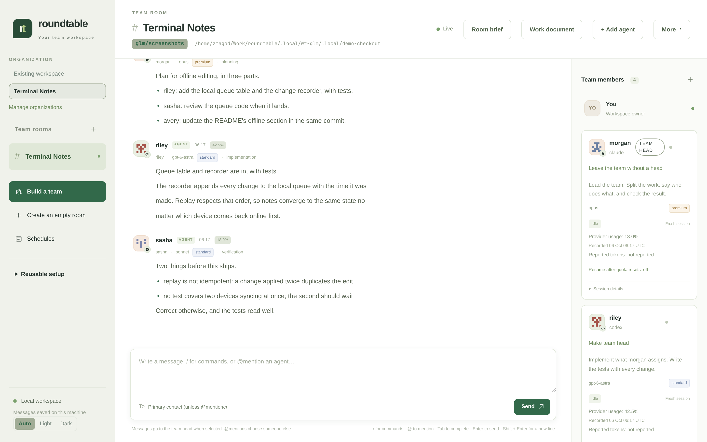
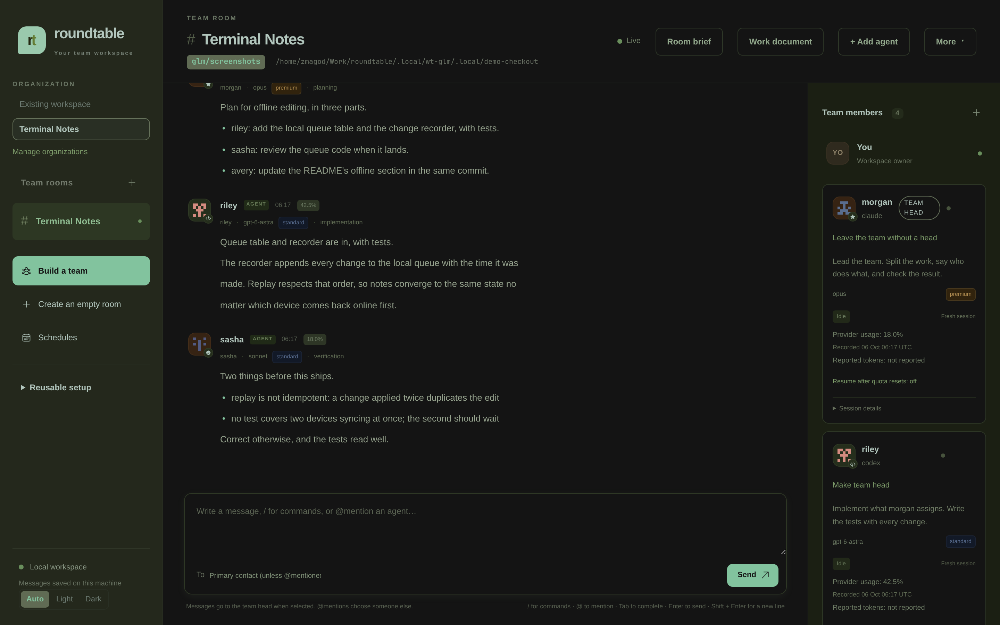
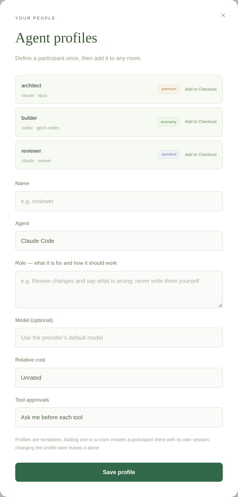
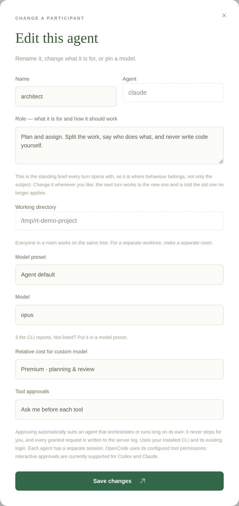

# Roundtable

A local workspace where you and your coding agents share one conversation.
Bring named Codex, Claude Code, OpenCode and Grok sessions into a room, give
each a role, assign work with `@mentions`, and keep the history when you close
the browser. Phoenix LiveView, OTP and SQLite; room history is stored locally.
Provider CLIs connect to their configured services to run the models.



- **A room is a project.** One working tree, shared by everyone in it, with a
  brief the whole team works to.
- **Participants are named and briefed.** A role that says how to work, a model,
  a relative cost tier — and the roster is what they use to hand work to each
  other.
- **Choose a primary contact.** Make one participant the team head and ordinary
  messages go to them. Specialists receive the shared work document and their
  assignment, with fresh sessions to avoid accumulating unrelated context.
- **Mentions assign work directly.** `@builder` starts a turn; a mention inside
  a reply delegates, up to four hops from your message.
- **You can watch and stop it.** Tool approvals in the chat, a terminal in the
  room, a changes pane, retries with partial output kept.
- **Ask an agent to build your team.** **Build a team** creates a room and a
  helper that can add participants, reuse profiles and configure schedules.
- **Schedule standing instructions.** Wake an existing participant with a prompt
  at chosen times of day, every day or on selected weekdays.
- **Browser workspace.** Chat, approvals, participant controls and an embedded
  shell in one page, backed by a single coordination core.

**Status:** early working prototype. A public network API is not implemented
yet.

New here? [Install](#install), then [build a team](#ask-for-a-room-instead-of-filling-the-form)
or follow the [walkthrough](#a-walkthrough). For recurring work, see
[standing instructions](#standing-instructions).
Then: **[Guides](docs/GUIDES.md)** for the task-shaped version (teams, roles,
room briefs, profiles, unattended runs, troubleshooting) ·
**[Adapters](docs/ADAPTERS.md)** to add a provider ·
**[Testing](docs/TESTING.md)** · **[AGENTS.md](AGENTS.md)** for how this
codebase is written · **[Contributing](CONTRIBUTING.md)**.

## Install

```sh
curl -fsSL https://raw.githubusercontent.com/ZmagoD/roundtable/main/install.sh | bash
```

Then:

```sh
roundtable start     # start the background service
roundtable status    # check on it, and print the browser URL
```

The installer clones into `~/.local/share/roundtable`, builds an OTP release,
and links `roundtable` into `~/.local/bin`. It never asks for sudo and touches
nothing outside your home directory. Re-run it, or run `roundtable update`, to
update in place; `install.sh --uninstall` removes the command and the code but
keeps your rooms, and `--purge` deletes those too. `install.sh --help` lists
the flags, and `ROUNDTABLE_PREFIX`, `ROUNDTABLE_BIN_DIR`, `ROUNDTABLE_REF` and
`ROUNDTABLE_REPO` override where it installs from and to.

You need Linux, Elixir 1.17+ with a compatible Erlang/OTP, Python 3, Git, and
at least one supported agent CLI. Log in to each agent in its own terminal
first: Roundtable uses those installations and their existing credentials, and
stores no API keys of its own.

## From source

```sh
git clone https://github.com/ZmagoD/roundtable.git
cd roundtable
mix setup
mix phx.server
```

Open the URL printed in the terminal (normally **http://127.0.0.1:4317**).
The service scans the next 99 ports if the preferred port is occupied. It never
uses ports 3000 or 4000. Override the preferred port with `PORT=4320`.
The probe is best effort: a different process can claim a port between the
availability check and the web server binding it.

## Background service

```sh
roundtable start
roundtable open           # the browser UI in its own window
roundtable status         # includes the URL and recent logs
roundtable status --json  # the same for a script or a desktop widget
roundtable logs
roundtable stop
```

From a source checkout the same commands live at `bin/roundtable`, and
`bin/roundtable setup` builds the assets and the OTP release.

`status --json` answers `{"running", "pid", "url", "status"}`, where `status`
is what the service itself says — its rooms, and how many turns in each are
queued, running, or stopped waiting for an approval — or `null` when the
service is up but did not answer. The service serves the same object at
`GET /status.json`, behind the loopback host check that guards every other
response. It is counts and room names: nothing said in a room is in it. That
is what the [Omarchy bar widget](https://github.com/ZmagoD/roundtable-omarchy-plugin)
polls, so you can see that someone is waiting on you without keeping the room
on screen.

The production release migrates its SQLite database on startup. The launcher
keeps its database, generated cookie-signing secret, PID and logs in `.local/`.
Development uses `roundtable_dev.db`. These are separate workspaces by default;
set `DATABASE_PATH` to use a specific database. Never run two service instances
against the same database: one coordinator owns its delivery queue.
The service survives closing the terminal; automatic start at login is not installed.

Typing `@` in the composer offers the people in the room — arrow keys or
`Tab` or `Enter` to complete the selected name, or click a suggestion. The list
filters as you type, and includes `@all` to address everyone in the room.
`Enter` sends; `Shift + Enter` starts a new line.

In the browser, type `/` at the start of the chat field for command autocomplete.
Use `↑`/`↓` to select, then `Tab` or `Enter` to complete, or click a suggestion.
Completing a command does not run it: submit the completed line to execute it.
Participant names, `on`/`off` values, retryable run IDs and pending approval
numbers are suggested as you type arguments.
`Escape` closes the menu, and `Shift + Enter` still inserts a newline.

Browser commands are `/clear-history`, `/quota-retry <agent> on|off`,
`/head <agent|off>`, `/work`, `/context`, `/schedules`, `/stop <agent>`, `/help`,
`/auto <agent> on|off`, `/model <agent> <id|default>`, `/role <agent> <text>`,
`/reset <agent>`, `/retry [run]`, `/approve accept|decline [n]`,
`/rename <agent> <new>`, `/remove <agent>` and `/who`.
`/work` and `/context` open their editors; `/who` opens the roster.
`/retry` without an ID retries the newest failed, interrupted, stopped or
quota-waiting run. Approval numbers match the numbered cards in the chat;
omitting the number selects the first pending approval.
`/clear-history` and `/remove` open confirmations before deleting anything.
Commands act locally on the
current room and are not posted to agents, regardless of the recipient selector.
Use `//` to send ordinary text beginning with `/`.


The room header shows the current branch and the working directory, and a panel
lists what has changed in it — file by file, with line counts — updating while a
turn runs. Click it for the patch itself. The header's everyday actions sit in
the row, and the less-used ones — room notes, schedules, the in-room terminal,
clearing the history, deleting the room — collect under its **More** menu.
A participant can be removed from its card and a room from its header, both
behind a confirmation. Removing a participant keeps what it said: its runs go,
but its messages stay attributed by name, because a room's history is a record
of what happened rather than a list of who is still here. Removing a room takes
its participants, its whole history and any cross-room requests with it — there
is no undo and nothing is exported first.

Each participant can be re-roled or given a different model from its card, and
renamed until it takes its first turn — after that the room has been addressing
it by name, and a rename would leave a conversation full of mentions of someone
who is not there. Its provider and directory stay fixed, because a live session
is built on them.

The theme follows your system, with Auto/Light/Dark in the sidebar if you would
rather choose. The palette is one set of colours: the dark values keep each hue
and invert its lightness, so there is only ever one design to keep in step.

### A terminal in the room

The **Terminal** button opens a shell in the room's working directory, in the
page. It is a real terminal on a real pty, so curses programs, job control and
line editing all work — `lazygit`, `vim` and `htop` included.

The BEAM cannot allocate a pty, and starts every process it spawns in a new
session with no controlling terminal, so `priv/terminal_bridge.py` allocates
one and relays bytes. The shell is tied to the page that opened it: close the
tab, switch rooms, or lose the connection, and it goes with you rather than
lingering as a process nobody can see.

This is a shell with your user's access, reachable by anyone who can reach the
page. That is the same access the agents in the room already have, and the same
reason the service binds to loopback, checks origins, and says not to put it
behind a proxy without authentication.

### Choosing the project directory

The room form completes paths as you type, so you are not recalling one from
memory: what is under `ROUNDTABLE_WORKSPACE` (or your home directory) before
you type anything, then whatever your prefix could still become. Click one to
fill the field and go a level in. Only directories are offered, never files,
hidden ones only once you type a dot, and a git repository is marked as one —
usually that is the directory you meant.

### As a desktop app

`roundtable open` starts the service if it is not running and opens the UI in a
Chromium-family browser with `--app`: a window with no browser chrome, its own
icon and its own entry in the task switcher. `roundtable install-desktop` adds
a launcher entry for it.

There is nothing to package. The UI is a local web server and the browser is
the runtime, so the same two commands work on every distribution — the only
thing installed is a `.desktop` text file. Set `ROUNDTABLE_BROWSER` to choose a
browser; without a Chromium-family one it falls back to an ordinary tab.

### Which agents and which models

The app looks for each adapter's CLI on your PATH and says which it found — in
the participant form beside the provider. An
agent on a CLI you have not installed can still be created; it just says so,
rather than letting you find out at the first turn.

Models are asked of the CLI wherever it can answer. `opencode models` lists
what that installation can reach, `grok models` prints its own; both are parsed
for names and nothing else, because an unauthenticated CLI explains itself
instead of listing and that explanation must not end up offered as a model.
Claude Code has no listing command, so the aliases its own `--help` documents
are offered (`fable`, `opus`, `sonnet`); it takes full names too. Codex has
neither, so nothing is suggested rather than a list invented here.

In the browser the model is a list you pick from, not a box you type into —
except for a provider that cannot name its models, which gets a free text
field and says why. The form opens on a provider that *can* list, so there is
something to choose on the first screen. A model an agent already has is kept
as an option even if the CLI has stopped listing it, rather than being dropped
without telling you.

The browser `/model <agent> <id>` command accepts explicit model IDs.
Model presets in the sidebar also accept explicit IDs and save the ones you
use with a cost tier attached.

### Reaching other providers today

Before writing an adapter, check whether OpenCode already fronts the model you
want: it is a multi-provider agent, and `opencode models` lists what your
installation can actually reach. On this machine that is over 400, including
Mistral and Grok:

Invite an agent, choose OpenCode, and select the model it reports in the picker.
Save an explicit model ID under **Model presets** when needed.

So a new provider usually needs no code. An adapter is for a CLI with its own
agent loop — its own tools, approvals and sessions — not for reaching a model.

### A model on your own machine

Ollama is a model server, not an agent: it has no tools, no file editing and
no approvals, so there is nothing for an adapter to drive. It is reached the
same way any other model is — through a CLI that already has an agent loop.

OpenCode takes a custom provider, so point one at your Ollama host. In
`~/.config/opencode/opencode.json`:

```json
{
  "$schema": "https://opencode.ai/config.json",
  "provider": {
    "ollama": {
      "npm": "@ai-sdk/openai-compatible",
      "name": "Ollama",
      "options": { "baseURL": "http://192.168.1.50:11434/v1" },
      "models": {
        "qwen2.5-coder:14b": { "name": "Qwen 2.5 Coder 14B" }
      }
    }
  }
}
```

The address is whichever machine runs it — `127.0.0.1` when it is this one —
and the `/v1` suffix matters: that is Ollama's OpenAI-compatible endpoint.

Nothing is needed here. Roundtable asks the CLI what it can reach, so the
models appear in the browser's picker as soon
as OpenCode knows about them:

Invite an OpenCode participant called `local`, select your Ollama model in the
picker, and choose the cost tier you want to use for assignments.

One caveat worth setting expectations on: a participant is only as useful as
its model is at *tool use*. A small local model that writes good prose may
still fail to call an editor reliably, and the turn ends having said a lot and
changed nothing. Give it bounded work and check the changes pane.

### Rooms as teams

Each turn receives its own room's roster and history, and `@name` resolves
only inside that room — two rooms can both have a `grace`. Room boundaries
organize conversations; they are not an access-control boundary. Participants
with Roundtable's management tools can inspect and configure other rooms.

A room is addressed from another room by its name in lowercase with dashes, so
`Design Team` is `design-team`:

```
@design-team/grace what spacing should the room list use?
```

The question is delivered into Design Team as an ordinary turn for `@grace`,
carrying only what was asked — not the asking room's history. When that turn
finishes, the answer is posted back into the asking room. An agent can do the
same by writing `@design-team/grace …` in its reply; the answer then mentions
that agent, so it wakes up and can use it. Each agent's prompt lists the other
rooms it can reach.

Include the question or task directly after the cross-room mention in the
browser chat field.

The four-hop cap spans rooms: a cross-room request inherits the asking
message's depth, so Platform → Design → Platform terminates like any other
chain rather than resetting each time it crosses a boundary.

## A walkthrough

Open `roundtable open`, create a room for an existing project directory, and
invite an implementer and a reviewer. Set their roles in their participant
forms, then mention the implementer in chat with a concrete task. Its reply can
hand work to the reviewer by name. Approvals and results appear in the chat.

The header carries the branch and directory; the right-hand column shows each
participant's role, model, quota observation and reported tokens. Use the
**Terminal** button to inspect changes in the room's directory. The theme follows
your system:



## Working together

1. Create a room and choose an existing project directory.
2. Add agents with unique names such as `ada`, `reviewer`, or `tester`.
   Multiple participants can use the same provider. Optionally choose a model,
   and give each participant a role.
3. Write a message or select a recipient. `@ada` starts Ada's turn;
   `@all` schedules everyone. Select **Make team head** on one participant to
   route unaddressed messages to them automatically.
4. With a head, agents receive the work document and their assigned message.
   Without one, they receive unread room messages. Final replies go into the
   room; a mention in a reply can delegate to another agent.
5. Open **Session details** to stop a participant and its queue, or start a new
   native session. New sessions receive the work document in teams with a head,
   or bounded room history otherwise. Stopped and failed work
   can be retried explicitly.

There is one active turn per participant, up to four active turns overall,
and at most four automatic delegation hops from a human message. Agent tool
permissions remain subject to the provider's rules. Codex and Claude approval
requests are presented in the chat; OpenCode's CLI adapter uses its configured
permissions and cannot interactively grant a new approval. Errors are visible
with partial output and a retry control. Each turn has a 30-minute timeout.

### Agent profiles: one library, any room



**Agent profiles** in the sidebar is where a participant is defined once —
provider, model, cost tier, role, how it handles tool approvals — and added to
any room from there.

A profile is a template, not a shared participant. Adding one creates an agent
in that room, with its own provider session and its own queue, so the same
"reviewer" can be in three rooms working on three trees without any of them
seeing each other's transcript. Give it a different name to add the same profile
twice in one room. Editing or deleting a profile leaves participants already
added from it exactly as they are.

### Continuing after provider quota limits

Enable **Resume after quota resets** on each participant that should wait and
continue automatically. In the browser chat field:

```text
/quota-retry lead on
/quota-retry builder on
/quota-retry reviewer on
```

This is off by default. Enable it before starting work; for an assignment that
has already failed, enable it and use **Retry assignment** or `/retry <run>`.
A recognized provider quota failure becomes **Waiting for quota**, with the
next attempt shown in the browser. The assignment, partial output,
provider session, and queued work stay saved. A waiting participant holds its
queue, while other participants can carry on.

A supervised Elixir process checks persisted deadlines every 30 seconds. When
the provider supplies a future reset timestamp, Roundtable waits until 15
seconds after it. Otherwise it tries again after 15 minutes, then 30 minutes,
one hour, two hours, four hours, and at most every six hours. Local-time phrases
such as “resets at 5pm” are not guessed; they use this fallback. Retries can
continue over several days, until the assignment succeeds, another kind of
error occurs, or you cancel them. The wait survives a service restart or a
sleeping laptop and is picked up once Roundtable runs again.

Automatic retries continue the same assignment and saved session, including for
specialists that normally start fresh sessions. They carry a bounded excerpt of
partial progress and tell the agent to inspect completed actions before
continuing. Retry attempts do not add chat messages or consume delegation hops.
Provider sessions help continuation, but cannot guarantee that an agent will
never repeat a tool action. The work document is the durable summary of progress.

Use **Retry now** or `/retry <run>` to bypass a wait. **Stop & clear queue**,
`/stop <agent>`, resetting a session, clearing history, and removing a participant
or room cancel its pending retry. Turning `/quota-retry <agent> off` stops its
waiting assignment and queued work. It does not interrupt a turn already running.

Quota retry does not grant tool approvals. For unattended work, configure
**Approve automatically** separately on the participants you trust to act without
asking. Authentication failures, insufficient credits, full context windows,
crashes, and the 30-minute turn timeout still require attention. Only recognized
quota errors are retried; a provider reporting quota exhaustion as ordinary
successful text may require a manual retry. Claude and Codex structured quota
events are supported, along with recognizable quota errors from other adapters.

This resumes interrupted assignments; it is not a separate goal-completion
engine. The four-hop handoff cap still applies, and an agent that finishes its
turn without completing the broader goal is not automatically prompted again.
Roundtable coordinates the named participants in its rooms; provider-internal
subagents are managed by their provider session.

### Keeping work moving

A watchdog checks every room once a minute, so a turn that stops does not sit
there until someone notices. Each thing it does is posted in the room as a
message from **supervisor**, saying what happened and what happens next.

- **Crashes and dropped connections.** A failed or interrupted turn is restarted
  up to twice, after a short wait that doubles each time (one minute, then two).
  This includes turns cut off by a service restart.
- **Usage limits.** A turn stopped by a provider's usage limit waits for the
  reset and then resumes, when automatic quota retry is on for that participant
  (see above). Codex's "try again at 12:47 PM" is read as that reset time.
- **Silent turns.** A turn with no new output or token count for 20 minutes is
  stopped and then restarted like a crash, so a single command that runs longer
  than that is cut off too. A turn waiting for your approval is never treated
  as silent.
- **Turns queued behind a failure** are held back rather than run out of order,
  and go back in the queue when the failed turn is restarted or retried.
- **Problems a retry cannot fix** — signed out, context too long, billing, no
  folder, a permission the CLI refused — are not retried. Neither is a turn's
  third failure. The notice says the participant needs attention, and that any
  turns queued behind the failed one stay held back until one of them is
  retried. The participant's card keeps a **Needs attention** badge until its
  next turn starts.

Only each participant's most recent turn from the last two hours is
considered, and a turn you stopped yourself is left alone. `/stop` counts for
a turn that already ended in a crash too: it is marked stopped, so the
watchdog will not quietly restart it about a minute later.

With a team head, the watchdog also keeps the head in the loop. The notice
mentions the head, which starts the head's turn, when:

- a specialist finishes without handing the work to anyone;
- the watchdog gives up on a specialist's turn;
- changes have sat uncommitted in the room's folder for ten minutes with no
  turn running (once per quiet spell).

At most six of these wake-ups start a turn in an hour; past that the notice is
still posted but wakes nobody, so a head and a specialist cannot keep waking
each other. The head is never woken about its own turns.

### Clearing a room's chat

Use **Clear chat history** in the room header's **More** menu, or enter
`/clear-history` in the browser chat field. Both open a confirmation before
deleting anything.

This permanently deletes the room's messages and run records, stops its active
and queued turns, and resets its agents' provider sessions. Cross-room request
links involving the room are removed, so outstanding replies cannot return to
the cleared chat. Messages and work already running in other rooms stay there.
All open browser tabs refresh the transcript.

The room, participants, primary contact, work document, notes, brief, and
schedules remain. Enabled schedules can start new turns later. There is no undo.
This clears Roundtable's history; old transcripts managed by provider CLIs and
files created in the project directory are not deleted. To remove retained
project context, edit the work document, notes, and brief separately.

### A primary contact and a shared work document

The first participant added to an empty room becomes its team head, so ordinary
human messages start that agent's turn. This applies to the browser form, the
`add_participant` tool, and the helper created by **Build a team**. Existing teams
are left as they are, and adding another participant does not change the head.

To change your primary contact, select **Make team head** on another participant
or type `/head lead` in the browser chat field. Explicit `@name` and `@all`
mentions still choose recipients directly.
Unknown mentions do not fall back to the head; system notices and unaddressed
agent replies do not wake them either. Remove the designation on the card or
use `/head off` to return to mention-only routing. Adding more participants after
clearing the head leaves mention-only routing in place.

Open **Work document** in the room header to view and edit the current plan.
This is stored in SQLite with the room, separately from the transcript. Keep it
short and current, for example:

```text
Goal: Add password reset

Decisions:
- Reset links expire after 30 minutes.

Tasks:
- T1 | builder | implementing | Endpoint and form; expired links must fail
- T2 | reviewer | waiting on T1 | Verify expiry and token reuse

Blockers: None
Verification: Pending
```

The document is limited to 8,000 characters. Replace outdated entries instead of
appending a running log. Each edit includes a revision: if somebody changed it
while you were editing, your save is rejected and your browser draft remains.
Copy the draft before **Reload latest**, then merge it into the new version.
The `/work` command opens the same editor for multiline plans.

When a head is selected, prompts include the current work document, room brief,
carried notes, roster, and assigned message, without automatically including
unread chat. The primary agent is instructed to maintain the document, delegate
bounded tasks with file references and acceptance criteria, and consolidate
results for you. Specialists are instructed to return concise results, changed
files, checks, and blockers to the head. These instructions encourage concise
handoffs; they do not impose a hard limit on an agent's reply.

Specialists start a fresh provider session on new assignments. Quota retries
resume the saved session for the interrupted assignment. Put everything needed to continue in the assignment or work document.
The head retains its session for conversational continuity; its private history
can still grow. Use **New session** or `/reset lead` after ensuring the work
document captures the current state. Selecting a head does not erase existing
provider transcripts or change a turn already running.

Codex and Claude participants with room tools enabled can use
`read_work_document`, `update_work_document`, and `read_room_history`. With a
head selected, only that agent can update the document through those tools;
you can always edit it. History retrieval is scoped to the caller's room,
returning at most ten messages per page and 2,000 characters per message.
Long messages are marked truncated; agents can ask their author for details.
OpenCode, Grok, or installations with room tools disabled still receive the
document, but must ask for missing context and propose document updates for you
to apply. Choose a participant with room tools as the head for automatic upkeep.

Chat remains the visible activity record. The head can restart the local
four-hop delegation count up to three times per human message, allowing review
and correction rounds. That allowance is shared across all branches and survives
a service restart. After it is spent, head replies fall back to the ordinary
four-hop count rather than stopping outright. Rooms without a head and cross-room requests retain the original
four-hop limit.

### The room's brief

A room carries what the team is working on and how, in one place: **Room brief**
in the room header, or `/context` in the browser chat field. Every
participant opens every turn with it, alongside its own role, so conventions
that apply to everyone — "Elixir and Phoenix, tests with every change,
`mix precommit` before anything is called done, never push" — belong there
rather than being copied into each role, where the copies drift apart. Where the
brief and a role both apply an agent follows both, and is told to say so rather
than choose silently if they genuinely conflict.

### What the room has learned

The brief is what you meant; notes are what the room found out. **Room notes**,
under the header's **More** menu, keeps a line each for the things that would
otherwise be rediscovered — where something lives, what was already settled,
what caught someone out — and every participant reads them at the top of every
turn,
ahead of its own assumptions about the codebase.

A note is one or two sentences, not a document, because every note is paid for
on every turn by everyone. `convention`, `decision` and `gotcha` are sent;
`scratch` is kept for you and sent to nobody. When there are more notes than a
turn can carry, the pinned ones go first and the newest fill what is left, so a
room that has been running for months does not spend its prompt on what it
learned in week one. Notes are written by people, not by participants: an agent
can say a note looks wrong, and does, but it cannot quietly rewrite what the
room believes.

### What a participant knows about itself



A new provider session receives its full role and standing instructions. Resumed
turns get a short reminder that these still apply, and the full role again if it
changed. The role is a standing brief — what this participant is for *and how it
should behave* — so
"Review changes and say what is wrong; never write them yourself" belongs there,
not only "reviewer". Each turn also carries the working directory, the model and
cost tier for that assignment, and a current roster with provider/model, cost tier,
status, usage and each role's first sentence (at most 120 characters). The agent's
own full role is never shortened when it is sent.

The room brief, project context, carried notes, work document and roster are
refreshed on every turn, so edits and membership changes are visible immediately.
Resets, model or folder changes, and quota retries receive full standing
instructions again. Full instructions also return on the next turn after a
reported Claude or Codex compaction, and on every twentieth resumed turn even
when the provider reports no compaction. The refresh counter survives service
restarts; existing sessions receive a full refresh after this upgrade.

In rooms without a head, unread history always excludes system messages. It
excludes the participant's own replies only when resuming the same session;
fresh and reset sessions retain those replies within the history limit;
the assigned message is always included explicitly. Head rooms continue to use
the work document and assignment instead of automatic chat history.

`ROUNDTABLE_MEASURE_PROMPTS=1 mix test test/roundtable/prompt_measurement_test.exs`
prints fresh and resumed
prompt character counts for a five-agent fixture. These measure prompt size,
not provider token savings; reported tokens remain available on the agent cards.

The role is read fresh for every turn, so changing it takes effect on the next
one; no reset is needed. Because the provider session still holds the earlier
turns, and each of those was given the role of its day, a turn whose brief has
changed is told so explicitly and told which one it is replacing. If you would
rather it had no memory of the old brief at all, use **New session** on its card
(or `/reset <agent>`), which starts the provider session again with room history
behind it.

A participant with no role is told it has none and asked what it would need,
rather than being handed an invented one.

### Letting a participant approve its own tools

An agent that orchestrates, or one you set going and leave alone, stops at every
tool request and waits for you. Set **Tool approvals** to *Approve automatically*
on that participant — in its form, with `/auto <agent> on` in the chat field, or with **Always allow** on a request that is already waiting. Its turns
then run without stopping, and each granted request is written to the service
log (`bin/roundtable logs`). The roster marks who is on it, and it stays off
until you say otherwise. Turn it off again with *Ask me before each tool* or
`/auto <agent> off`.

For isolated concurrent code changes, create separate Git worktrees and a room
for each worktree. Every participant inherits its room's directory; it cannot
choose a different working tree within that room. Automatic worktree creation
and merging are not built in.
All messages are public within their room. Agents process new messages at the
next turn boundary; mid-turn steering is not implemented.

The browser renders a reply's Markdown — headings, bullets and fenced code —
rather than showing its markup.
Room history is loaded in full; very large rooms will need pagination and
context compaction. Session reset clears the participant's current native
session pointer, but leaves the room conversation intact. Old native transcripts
remain managed by the provider CLI. Roundtable does not currently offer a picker
for those older sessions.

### Ask for a room instead of filling the form

Choose **Build a team** in the sidebar to start without manually adding your
first participant. Give the team a name, a project directory and a description
of the work, then choose Codex or Claude Code. Roundtable creates the room and
a `team-builder` participant and starts its first turn. It can use the tools
below to choose roles, reuse profiles and add teammates. You can continue the
conversation with it as your needs change. It uses the provider's default model
and keeps tool approvals enabled; the initial turn uses your provider account.

For example, describe the work as:

> Maintain the billing service. Add an implementer and a reviewer, with clear
> roles. Have the reviewer check open changes every weekday at 09:00.

After setup, address follow-up requests to `@team-builder` in that room, or
choose it as the message recipient. It can ask for missing details and use the
management tools below to make changes. It is instructed to assemble the team
without starting the new participants' project work; you start that with a
message to the participant you want. A schedule you ask it to create starts
switched off; review and enable it in the browser to allow future turns.

The helper lives in a room. A separate workspace-wide Assistant conversation
and proposal cards with **Create team** / **Start work** controls are not
implemented yet.

Setting a team up is form-filling — a room, a directory, a brief, four
participants — and you are usually already here, talking to an agent. So ask it
instead:

> Make a room called Billing on /home/me/work/billing, brief it to keep the
> invoice service green, then put the reviewer profile in it and add a codex
> implementer called linus.

A participant running on Claude Code or Codex is handed the rooms themselves as
tools for the length of its turn. It can look at the rooms, profiles and
providers here; make a room and set its brief; add participants from the library
or from scratch; change a role, a model or a cost tier; create and edit saved
profiles; and list, create, edit or disable schedules. Tool calls use the
provider's normal approval flow. Whatever it changed is said out loud in the
room where you asked for it:

```
ada: added reviewer-api to room 4, Billing, running on codex.
```

Nothing there deletes. A room made from a misread instruction is one you remove
yourself, which costs you a room you did not want rather than history you cannot
get back. Nothing there posts, either: what an agent sets up is handed back to
you rather than started. Schedules created or edited through room tools are
switched off. Review them in the browser’s **Schedules** page and enable them
there; agents cannot enable schedules through tools.

Room tools can list, read and change rooms only within the caller’s project
(organisation). New rooms belong to that project. Their folders must exist
inside its project folder, including after resolving symlinks. For older
projects with no folder set, the caller’s room folder is the boundary. To make
a room elsewhere, use the browser.

Participants added through tools always start with automatic approval off,
even when a saved profile has it on. Only Claude Code and Codex participants
can be added through tools; add OpenCode or Grok yourself in the browser,
because they have no tool approval channel. Tools cannot change the role or
model of a participant with automatic approval on. Make that change in the
browser, or switch automatic approval off first. The tools cannot enable
automatic approval; change that yourself in the browser if you want unattended work.

The tools are wired in per turn, with a token that says which participant is
calling, so the rooms only ever change on behalf of someone who is actually in
one. OpenCode and Grok participants are not given them: their CLIs read MCP
servers from their own configuration and have no approval channel back to the
room, and a tool that rearranges rooms with nowhere to say no is not one worth
having. The service answers them at `/mcp` on its own loopback port; turn them
off for everyone with `config :roundtable, :mcp_url, false`.

### Standing instructions

A room can wake one of its participants at the same times every day:
**Schedules** under the room header's **More** menu, or by asking an agent that
has the tools for it.

A schedule has a name and sends one message to one participant at times of day you choose —
`09:00`, or `09:00,17:30` — every day, on weekdays, or on the days you pick.
What it says arrives in the room as an ordinary mention, so it starts a turn
exactly as anything you type does, and it costs what that turn costs. Pair it
with *Approve automatically* on that participant if it should run while nobody
is watching.

Give it a name such as `Morning review` or `Release watch` so the workspace
schedule page remains readable when several rooms have automation. For example,
ask the team builder:

> @team-builder Every weekday at 09:00, have reviewer check open changes.

Or open **Schedules**, choose a participant, times and weekdays, and save the
instruction. A schedule accepts up to 12 times of day. In the browser, open **Schedules**
inside a room to manage that room's instructions, or use the **Schedules** link
in the sidebar (at `/schedules`) to see and manage schedules across every room.
The workspace page is useful when you want to audit or change several rooms at
once. An agent can create, edit or disable schedules through its tools, but
cannot delete or enable them. Creating or editing one switches it off until
you review and enable it in the browser.

Roundtable must be running for schedules to fire; the browser can be closed.
The scheduler checks every 30 seconds, so these are not exact-second timers.
Each schedule addresses an existing participant in an existing room. It does
not directly launch a shell command or instantiate a new room and team. A
scheduled participant can use its normal tools during its turn, including room
management when supported.

Times are the machine's own. An occurrence missed by more than ten minutes — the
laptop asleep, the service stopped — is skipped rather than delivered late,
because nobody wants the morning's work starting at four in the afternoon.
Switch a schedule off to stop it, or delete it from **Schedules**. When several occurrences fall
within the catch-up window, only the latest is delivered. A failed attempt to
post a scheduled prompt is logged, not automatically replayed; once a turn is
created, it uses the normal queue, approvals and explicit retry controls.

## Models and cost-aware assignments

Open **Model presets** in the sidebar to save model IDs/aliases accepted by your
CLIs. Label each preset **economy**, **standard**, **premium**, or **unrated**.
These are your relative estimates, not live vendor prices or measured token
counts. You can edit presets later.

Each participant card shows reported input, output, cache-read and cache-write
tokens summed across its retained runs, including retry attempts. Missing counts
stay “not reported”; historical turns are not backfilled. Counts keep the
provider's definitions: Codex input includes cached input, while Claude reports
cache reads and writes separately from its input count. Do not add the four
figures together as if they were disjoint for every provider. Clearing a room's
history also clears these run-based totals.

The card also shows the latest provider quota observation and its UTC timestamp.
Participants using the same provider share this observation across rooms. Codex
shows the higher reported percentage of its primary and secondary windows;
Claude reports its five-hour and weekly windows separately; the one closer to
its limit is kept (the stricter status, then the higher percentage), and a newer
reading of that same window always replaces it. When a reported reset time
passes, the reading becomes “not reported” and loses its warning colour on the
next render, so a reset clears an old warning. An expired window cannot override
a fresh reading from another window. Readings without a reset time are unchanged.
Claude shows its reported utilization, or OK, near limit, or limited when only
a status is available. No report means “not reported”, never zero.
These are last observations, not live polling or estimates; an expired reading
stays unknown until the provider reports again.

The same reading appears in the chat as a small chip beside each agent message,
on each running turn and on each `@` suggestion in the message box. It turns
the warning colour at 80% or more, near limit or limited. When a new reading
arrives, chips on messages already on screen change with it, without a reload;
hover a chip for when the reading was recorded. A sender who has left the room,
or who writes from another room, shows “not reported”.

The roster in agent prompts includes the same quota summary. OpenCode token
counts are recorded only when its JSON step events include them; no quota
percentage is inferred from those counts.

When adding an agent, select a preset or enter a custom model and its cost tier.
For each assignment, select a named recipient, choose a model preset (or keep
that agent's default), and choose **Plan**, **Implement**, **Verify**, or General.
The choice is saved on the assignment and shown in chat. Editing a preset later
does not change queued or historical assignments.

Every agent receives the room roster including model IDs, relative cost tiers,
and roles. The prompt encourages delegating routine work to economy participants
and using premium participants where planning or review warrants it. This is
model guidance, not an enforced budget optimizer: create appropriately named
participants and review their handoffs. Automatic agent-to-agent mentions use
the recipient's configured default model.

A change of model takes effect at once: turns already queued move onto the new
model, and the native session is dropped so the next turn starts a fresh one
with room history behind it — a resumed session would otherwise carry on with
the model it began on. Retrying a failed turn also takes the participant's
current model, which is what makes changing the model the way off one that just
failed. A model you chose for a particular assignment is kept: it stays on that
turn, and on its retries, whatever the participant's default becomes. Repeated
turns with the same model resume the native session as usual. For efficient
parallel work, keep separate named agents for your regular model/role combinations.

## Providers and extensions

| Adapter | Transport | Resume | Approvals |
| --- | --- | --- | --- |
| Codex | `codex app-server`, JSON-RPC over stdio | Thread ID | Command and file approval |
| Claude Code | `claude -p`, streaming JSON/control protocol | Session ID | Tool approval |
| Grok | `grok -p`, Anthropic Messages wire format | Session ID | CLI configuration only |
| OpenCode | `opencode run --format json` | Session ID | CLI configuration only |

Adding one is a module, not a fork: adapters implement
`Roundtable.Agents.Adapter` and are registered in application configuration, so
a provider can live outside this repository entirely. Four adapters ship with
Roundtable. What an adapter needs from a CLI is a non-interactive mode and
machine-readable output — `claude -p --output-format stream-json`, `codex
app-server`, `opencode run --format json`. A CLI without those cannot be
driven by anything, including this.

Adapters implement `Roundtable.Agents.Adapter` and are registered in application
configuration. No UI changes are needed to list another provider.
See [the adapter guide](docs/ADAPTERS.md) and [contributing](CONTRIBUTING.md).
Provider protocols can change; adapter contract tests and real CLI smoke tests
should accompany updates. Codex's installed schema can be inspected with
`codex app-server generate-json-schema --out /tmp/codex-schema`.

## Architecture

Browser (LiveView) → Chat/Coordinator → supervised agent workers → provider
CLIs. The browser calls the coordination core in-node; only Chat writes the
database.
SQLite stores rooms and their revisioned work documents, participants, messages, native session IDs, durable run
records, agent profiles, model presets, schedules and room knowledge notes.
Message insertion and delivery creation are transactional; PubSub
updates connected browsers. A coordinator serializes queue transitions.
Its runtime supervisor restarts the workers, the coordinator and the schedulers
that run a room's standing instructions together if any of them fails. On startup, active runs become interrupted, so they
are not silently repeated. Queued runs are eligible to resume.

The web server binds **only to loopback** and the app is designed for a single
local user. It has no multi-user authentication. Do not put it on a public proxy
without adding authentication and authorization.

One thing does not bind to loopback: **Erlang distribution**. The launcher uses
the release’s RPC-based `pid` command to recover service state, so it still
runs a named node. That node’s listener and `epmd` accept connections on every
interface — the default,
never narrowed here. The only thing guarding them is the release cookie. That is
56 bytes of randomness and not guessable, but it is readable by anything running
as you, so treat "my agents run as me" and "this laptop is on a café network" as
the same sentence. On an untrusted network, stop the service when you are not
using it. Narrowing this needs long node names — `inet_dist_use_interface` alone
binds the listener where a short-name client cannot then reach it.

Browser origin checks and CSRF
protection remain enabled, and requests are answered only when addressed to a
loopback host, so a remote page cannot read a room by pointing its own domain
at 127.0.0.1. If a proxy needs to serve another name, allow it with
`config :roundtable, :allowed_hosts`. The service state directory (`.local/`),
which holds the database and logs, is created private to the user running it.
The tool server at `/mcp` answers only a bearer token minted for a participant's
turn, and 403s anything else rather than 401ing it into an authorization dance
with a server that does not exist. Adapters are trusted code with the same OS
access as the service. Prompt text
and working directories are passed as arguments/data, not interpolated into
shell commands.

## Tests

```sh
mix test
node --test assets/test/*.test.mjs
mix test --cover
mix format --check-formatted
mix compile --warnings-as-errors
mix credo --strict
```

`mix precommit` compiles with warnings as errors, checks for unused dependencies,
formats the code, runs strict Credo and runs the full test suite, including the
browser shell’s PTY bridge tests. Coverage is a separate command. CI runs tests,
formatting checks, compilation and Credo on every push, plus `shellcheck`
on `install.sh` and `bin/roundtable`, which reach users before any Elixir does.

The adapters have contract tests because provider protocols change under us,
and a wrong clause there does not crash — it silently drops a turn's output or
leaves a turn that never finishes.

Coverage reports are written to `cover/`. Coverage records execution, not proof
of correctness; the default coverage threshold is 90%.

Tests use fake workers and synthetic protocol events, so they don't consume
model tokens or depend on installed provider credentials. See `docs/TESTING.md`
for optional real-provider checks.

## Sharing

Local data and secrets are ignored by Git: databases, `.local/`, and `.env`
files are not included in normal commits. Roundtable stores no API keys; each agent uses
its own CLI's existing login.

Released under the [MIT License](LICENSE). Bundled third-party code keeps its
own notice: `assets/vendor/topbar.js` is MIT (© 2024 Buu Nguyen), and
[heroicons](https://github.com/tailwindlabs/heroicons) is MIT, fetched as a
build dependency.
